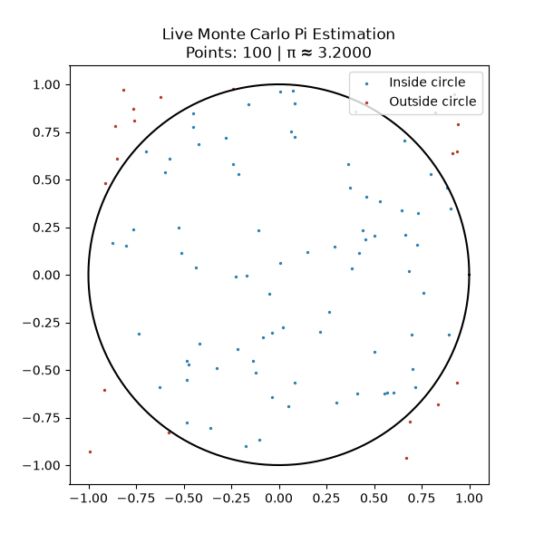
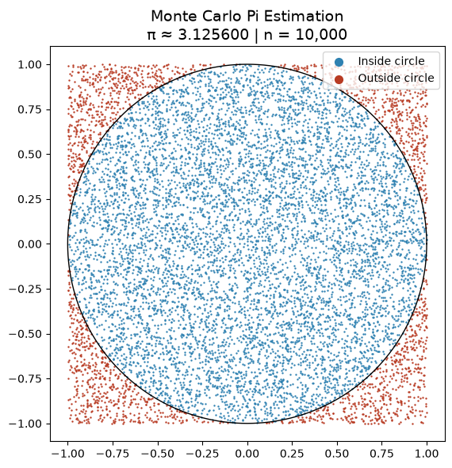
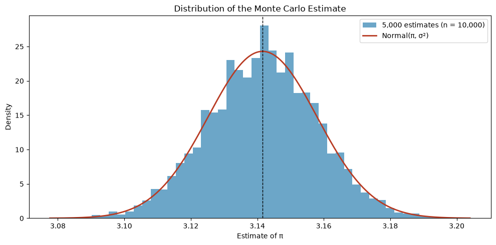
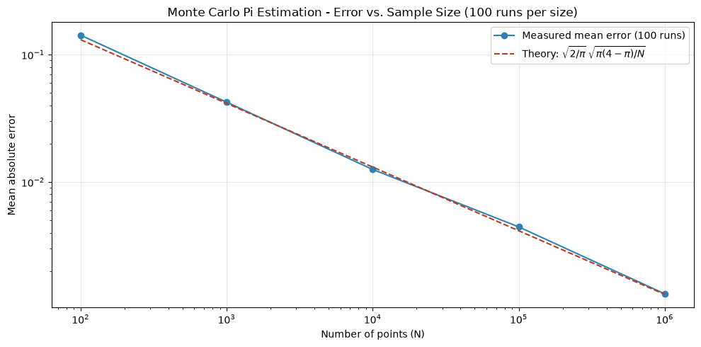

# 🎯 Monte Carlo Pi Estimation

Estimating the value of π using random sampling.

## 🔬 Background

The idea is simple: if you randomly throw darts at a square 
containing a circle, the ratio of darts landing inside the circle to the 
total number of darts approximates π:

**π ≈ 4 · (points inside circle / total points)**

This works because the area of a unit circle is π, while the area of 
the surrounding square is 4. The ratio of areas equals the ratio of 
random points landing in each region.

A point (x, y) is inside the circle when **x² + y² ≤ 1**, so the code 
only compares the squared distance with 1, no square root needed.

## 📊 Results

### Random Point Sampling

- 10,000 random points simulated
- Blue points → inside the circle
- Red points → outside the circle
- With the fixed seed (42): **π ≈ 3.1256** (error ≈ 0.016)
- An error of 0.01 to 0.02 is typical at this sample size

### Live Animation

- 100 points added per frame, 10,000 in total
- The running estimate is shown in the title of every frame
- Early frames jump around, later frames settle near π (never exactly on it)

### Distribution of the Estimator

- The experiment is repeated **5,000 times** with 10,000 points each
- Every run gives a slightly different π, and together they form a bell curve
- The red curve is **not fitted** → it is computed from theory only:
  **σ = √(π(4 − π) / N) ≈ 0.0164** for N = 10,000
- The histogram is centered on π → the estimator is unbiased
- Its width matches σ → theory and simulation agree

### Convergence Analysis

- 100 independent runs for each sample size, averaged
- Dashed line = theory: **mean error = σ · √(2/π) ∝ 1/√N**
- On a log-log plot, 1/√N is a straight line with slope −1/2
- Measured points wobble slightly around the line (that is sampling noise from using only 100 runs per size)

| Sample Size | Expected Mean Error |
|---|---|
| 100 | ~0.13 |
| 1,000 | ~0.041 |
| 10,000 | ~0.013 |
| 100,000 | ~0.0041 |
| 1,000,000 | ~0.0013 |

## 🧠 Physics Concepts Demonstrated

- **Monte Carlo sampling** — using random numbers to solve deterministic problems
- **Statistical convergence** — error decreases as 1/√n (same as measurement uncertainty in experiments)
- **Law of large numbers** — more samples = more accurate result
- **Central limit theorem** — repeated estimates follow a normal distribution around the true value
- **Unbiased estimator** — the average of many estimates lands on π

## 💡 Key Takeaways

- 10× more accuracy costs **100× more points**
- Six correct digits would need on the order of 10¹² points, so plain Monte Carlo is a poor way to compute π itself
- Its strength is that the 1/√N rate does **not** depend on the number of dimensions, which is why it is used for high-dimensional problems where grid methods become unaffordable

## 🌍 Real World Applications

Monte Carlo pi estimation is the simplest example of a family of methods used in:
- Nuclear reactor simulation
- Financial risk modeling
- Quantum mechanics calculations
- Medical radiation dose estimation

## 🛠️ Tech Stack

- Python 3.14.7
- NumPy
- Matplotlib
- Jupyter Notebook