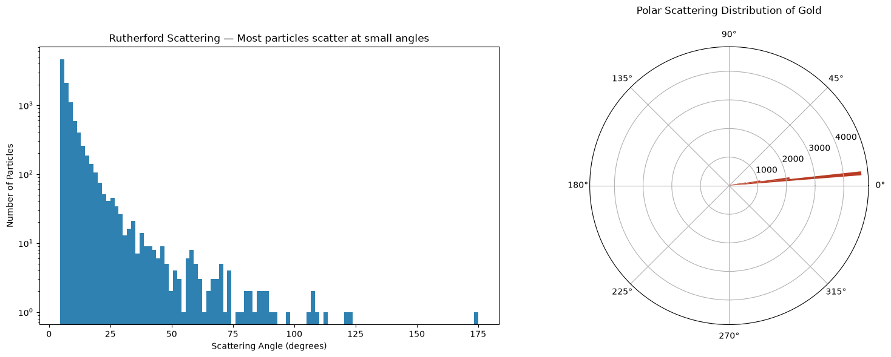
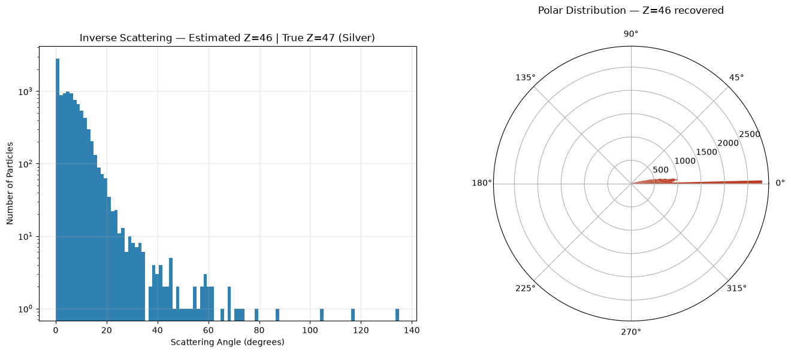
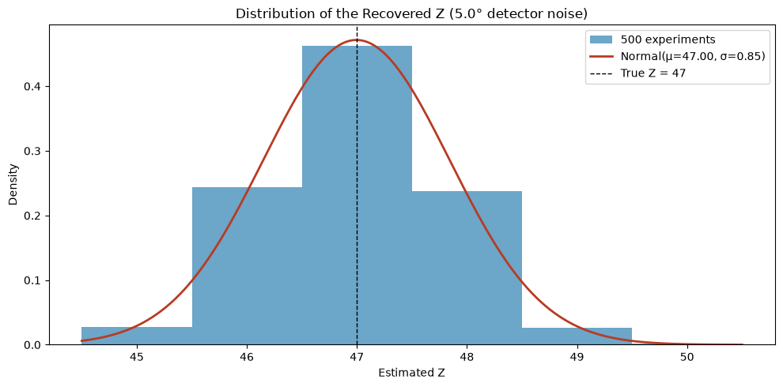

# ⚛️ Rutherford Scattering — Forward and Inverse Problem

Simulating alpha particles scattering off a gold nucleus with Monte Carlo methods — 
and then running the experiment backwards: recovering an unknown element's atomic 
number Z from nothing but noisy measured angles.

## 🔬 Background

In 1911 Rutherford fired alpha particles at a thin gold foil. Almost all of them passed 
through with little or no deflection, but a tiny fraction bounced back by more than 90°. 
That could only happen if the atom's positive charge sits in a tiny, dense nucleus.

The physics of a single particle is simple. A particle aimed with **impact parameter b** 
(its miss distance from the nucleus) is deflected by the angle:

**θ = 2 · arctan(a / b),  where  a = k · Z_alpha · Z · e² / (2E)**

- a larger Z or a lower energy E → a larger a → stronger scattering
- a large b → a gentle deflection, a small b → a violent one

**Monte Carlo idea:** a real beam is spread evenly over an area, so every particle gets 
a random impact parameter drawn uniformly over the beam's area (**b = b_max · √u**, 
with u uniform in [0, 1]). The angle distribution then emerges from many particles — 
the angle is never chosen, it is the *outcome*.

**Physical setup:** 5 MeV alpha particles on gold (Z = 79), lengths in femtometers:

- a ≈ 22.8 fm, so the closest approach head-on is 2a ≈ 45.5 fm
- the gold nucleus radius is ≈ 7.0 fm
- the alpha never reaches the nucleus → pure Coulomb (Rutherford) scattering is valid

## 📊 Results

### Forward Problem: Predicting the Scattering Distribution

- 100,000 alpha particles on a gold nucleus
- **97.8%** scatter below 30° → most particles barely deflect
- Large-angle events are rare but not impossible (log scale)
- **Theory check:** a particle scatters beyond 90° exactly when b < a, so the expected 
  fraction is (a / b_max)². Simulation: **158 particles** vs theory **156 ± 12** 
  (+0.2 std) → the simulation matches the exact result
- The ± is the typical random fluctuation of a count (1 standard deviation)

### Inverse Problem: Recovering Z from Noisy Angles

- A mystery material (silver, Z = 47) is simulated and its Z is **hidden**
- Detector noise: Gaussian, 5° (realistic is closer to 1°, 10° is a stress test)
- The estimator only sees the measured angles — never the impact parameters, 
  which no real experiment can measure
- **Method — simulation matching:**
  1. For every candidate Z (1 to 118), simulate the same experiment with the same 
     noise and record the median measured angle (a calibration curve)
  2. Take the median angle of the mystery data
  3. Pick the Z whose predicted median is closest
- Because the calibration includes the noise, the estimator is **unbiased**

### How Reliable Is One Experiment?

- The experiment is repeated **500 times** and every recovered Z is collected
- The estimates are centered on the true Z (mean ≈ 47.0) with a spread of σ ≈ 0.8–0.9
- The red curve is a normal distribution **fitted** to the results (mean and std taken 
  from the data) — not predicted from theory
- One experiment is typically within ±1 of the true Z about 90–95% of the time
- Numbers move by a few percent between runs, because the calibration curve is itself 
  a simulation

### Effect of Detector Noise

| Detector Noise | Std of Recovered Z | Exactly Right | Within ±1 |
|---|---|---|---|
| 1° | 0.26 | 93% | 100% |
| 5° | 0.82 | 50% | 95% |
| 10° | 1.54 | 21% | 70% |

- Z is recovered well at realistic noise (1°) and degrades gracefully as noise grows
- The typical deflection in this setup is only ≈ 6°, so 10° of noise is larger than 
  the signal itself — the method still works, with a visibly wider spread

## 🧠 Physics Concepts Demonstrated

- **Rutherford scattering** — deflection angle from the Coulomb force of a point nucleus
- **Monte Carlo sampling** — random impact parameters, uniform over the beam's area
- **Validation against theory** — simulated counts checked against an exact analytic result
- **Inverse problems** — inferring a hidden property (Z) from indirect, noisy measurements
- **Simulation-based estimation** — calibrating an estimator by simulating the experiment itself
- **Statistical uncertainty** — the spread of repeated estimates quantifies how far 
  a single measurement can be trusted

## 💡 Key Takeaways

- The forward model reproduces an exact analytic prediction within random fluctuation
- An honest inverse problem may only use what a detector can measure — using the true 
  impact parameters would give the right answer for any noise level, and prove nothing
- Reporting the **spread** of the estimate matters as much as the estimate itself
- Noise comparable to the typical deflection limits how precisely Z can be recovered

## 🧪 Model Assumptions

- Point nucleus, infinitely heavy target (no recoil), non-relativistic, single scattering
- No electron screening and no energy loss in the foil
- Beam radius b_max is a toy choice (a / b_max ≈ 0.04) — scattering is far stronger than 
  in a real foil, so large-angle events are visible with a 10⁵ particle simulation
- Detector noise is modeled as Gaussian on the measured angle, clipped to the physical range

## ✅ Tests

The simulation and estimator live in a module, `scattering.py`, covered by 8 pytest tests:

- **Physics helper** — a scales linearly with Z and inversely with energy
- **Physical range** — scattering angles stay between 0 and π, even with 10° noise
- **Reproducibility** — the same random seed gives identical angles
- **Theory check** — the fraction of particles beyond 90° matches (a / b_max)² within 4 std
- **Inverse problem** — Z is recovered within ±2 at 1° noise for Z = 30, 47, 79 and 100

## 📁 Code Structure

- `scattering.py` — simulation and estimator functions
- `notebooks/02_particle_scattering.ipynb` — forward problem, inverse problem, plots
- `tests/test_scattering.py` — pytest tests
- `results/` — saved figures

## 🌍 Real World Applications

The same forward-and-inverse logic is used in:
- Rutherford backscattering spectrometry — identifying elements in thin films
- Particle physics — inferring structure from scattering patterns
- Medical imaging — reconstructing the inside of the body from indirect measurements
- Geophysics — inferring Earth's structure from seismic signals

## 🛠️ Tech Stack

- Python 3.14.7
- NumPy
- Matplotlib
- pytest
- Jupyter Notebook